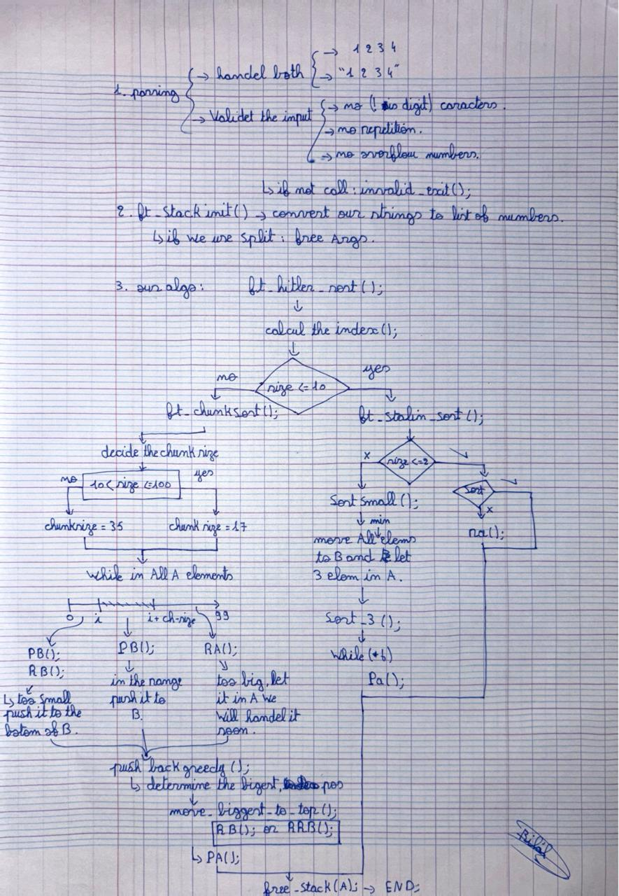

*This project has been created as part of the 42 curriculum by berrabia.*

# push_swap

## Description

The **push_swap** project consists of sorting a stack of integers using a restricted set of operations and an auxiliary stack. The goal is not only to sort the data correctly, but to do so using the smallest possible number of operations. The program takes a list of integers as input, validates them, and outputs a sequence of instructions that will sort the numbers in ascending order using only the allowed stack operations.

To achieve this efficiently, the project implements multiple sorting strategies depending on the size of the input. Values are first normalized using indexing, then dispatched to specialized algorithms optimized for small and large datasets.

---

## Instructions

### Compilation

The project is written in **C** and compiled using a **Makefile** with the following flags:

- `-Wall`
- `-Wextra`
- `-Werror`

To compile the program, run:

```bash
make
```

This will generate the executable `push_swap`.

---

### Execution

The program accepts integers as arguments. It supports both separated and quoted inputs:

```bash
./push_swap 3 2 1
```

or

```bash
./push_swap "3 2 1"
```

The output is a list of operations that, when applied, will sort the stack.

---

## Algorithm Overview


After parsing and validating the input, the program initializes stack A as a linked list and assigns an index to each element using a normalization phase based on sorted order. The main sorting logic then selects the appropriate strategy according to the stack size. For very small inputs, `sort_three` handles all possible permutations using minimal operations, while `ft_stalin_sort` and `sort_small` are applied for small stacks by repeatedly locating the minimum element with `find_min_pos`, rotating stack A using `move_to_top`, and pushing it to stack B with `pb`. For larger inputs, the `ft_chunksort` function is used, where the total range of indices is divided into chunks. Elements are pushed from stack A to stack B based on their index range, using optimized rotations with `ra` and `rb`. Once stack A is empty, the algorithm rebuilds the sorted stack using `push_back_greedy`, which repeatedly finds the largest indexed element in stack B, rotates it efficiently, and pushes it back to stack A with `pa`. This strategy minimizes the total number of operations while respecting all project constraints.

---

## Technical Choices

- **Indexing (`ft_calc_index`)**: Simplifies comparisons by replacing raw values with relative positions.
- **Dispatcher (`ft_hitler_sort`)**: Chooses the most efficient algorithm based on input size.
- **Small sort optimization**: Dedicated logic for stacks of 2 to 10 elements.
- **Chunk-based sorting**: Reduces operation count for large inputs.
- **Greedy reconstruction**: Ensures efficient reinsertion from stack B to stack A.

---

## File Structure

- `main.c` - Program entry point
- `ft_split.c` , `ft_stack_init.c` , `parsing.c` - Argument parsing and validation
- `ft_linked_list_tools`, `more_helpers`, `push_swap_tools`, `push_swap_tools2` - Stack and linked list utilities
- `sort_three`, `ft_stalin_sort`, `ft_chunksort, etc. ` - Sorting algorithms
- `Makefile` - our Makefile
- `push_swap.h` - header file
---

## Resources

- 42 push_swap subject
- (https://medium.com/@ayogun/push-swap-c1f5d2d41e97)
- (https://42-cursus.gitbook.io/guide/2-rank-02/push_swap)
- Big-O notation and algorithm optimization concepts

### AI Usage

Artificial Intelligence tools were used to help improve the quality of the documentation, and assist in debugging and reasoning about the sorting logic. All code was written and implemented by ana(kdob 7ram ana katb ghire chi 70% hh).

## Author

- **berrabia (ana hh)**

